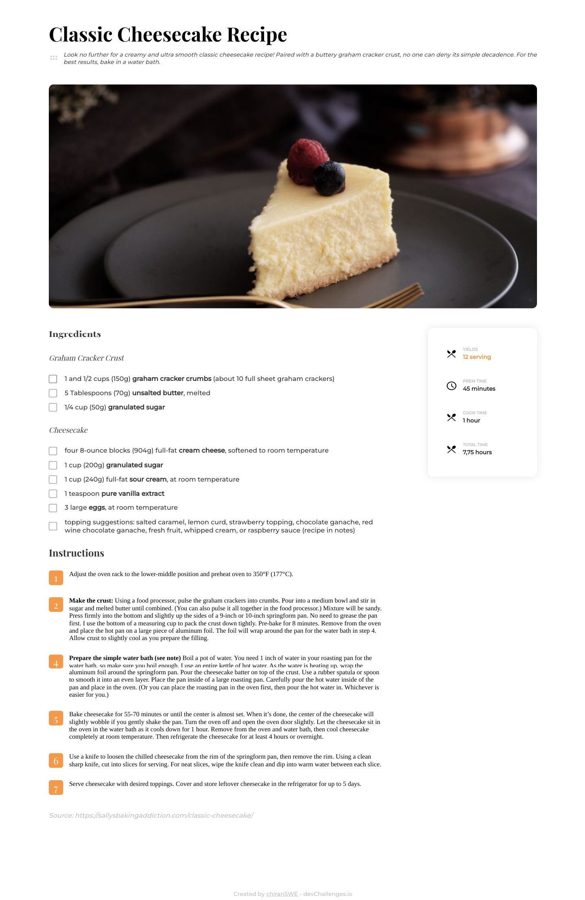
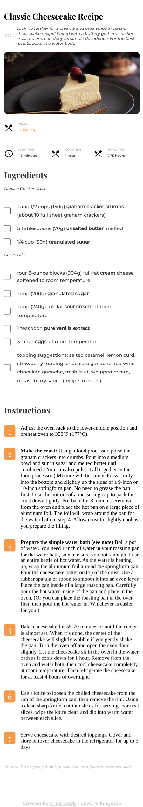

<!-- Please update value in the {}  -->

<h1 align="center">Chirans Interior Consultant</h1>

   Solution for a challenge from  <a href="https://devchallenges.io/challenges/gcbWLxG6wdennelX7b8I" target="_blank">Devchallenges.io</a>.

  <h3>
    <a href="chirans-interior-consultant.vercel.app">
      Demo
    </a>
     | 
    <a href="https://github.com/TheChiran/interior-consultant">
      Solution
    </a>
     | 
    <a href="https://devchallenges.io/challenges/Jymh2b2FyebRTUljkNcb">
      Challenge
    </a>
  </h3>

<!-- TABLE OF CONTENTS -->

## Table of Contents

- [Overview](#overview)
  - [Built With](#built-with)
- [Features](#features)
- [Contact](#contact)
- [Acknowledgements](#acknowledgements)

<!-- OVERVIEW -->

## Overview

#

### Desktop View

### Tablet View

### Mobile View

### Built With

<!-- This section should list any major frameworks that you built your project using. Here are a few examples.-->

- [HTML](https://html.com/)
- [CSS](https://developer.mozilla.org/en-US/docs/Web/CSS)
- [SCSS](https://sass-lang.com/)
- [Java Script](https://developer.mozilla.org/en-US/docs/Web/JavaScript/)
- [Vite](https://vitejs.dev/)

## Features

<!-- List the features of your application or follow the template. Don't share the figma file here :) -->

This application/site was created as a submission to a [DevChallenges](https://devchallenges.io/challenges) challenge. The [challenge](https://devchallenges.io/challenges/gcbWLxG6wdennelX7b8I) was to build an application to complete the given user stories.

## Acknowledgements

<!-- This section should list any articles or add-ons/plugins that helps you to complete the project. This is optional but it will help you in the future. For exmpale -->

- [Steps to replicate a design with only HTML and CSS](https://devchallenges-blogs.web.app/how-to-replicate-design/)
- [Node.js](https://nodejs.org/)
- [Marked - a markdown parser](https://github.com/chjj/marked)

## Contact

- Website [http://chirantonmoy.vercel.app/](http://chirantonmoy.vercel.app/})
- GitHub [@theChiran](https://github.com/TheChiran)
- LinkedIn [@tonmoy-chiran](https://www.linkedin.com/in/tonmoy-chiran-0920b2151/})
